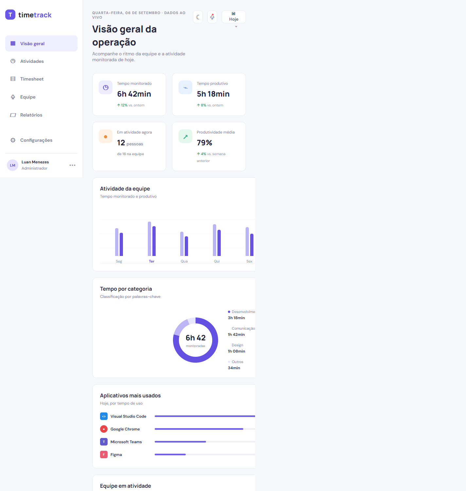

# Time Tracker — Dashboard Web

Dashboard do Time Tracker para acompanhamento de atividades, presença da equipe e indicadores diários. A aplicação é uma SPA construída com React, Vite, Tailwind CSS e Recharts.

O projeto consulta a API FastAPI quando ela está disponível e mantém dados demonstrativos como alternativa para que o protótipo continue navegável sem o backend. Para a visão geral do produto, consulte o [README da raiz](../README.md).



## Funcionalidades

- Consulta do resumo diário, atividades em tempo real e colaboradores pela API.
- Filtros por data e colaborador; datas futuras não podem ser selecionadas.
- Atualização manual e automática a cada 30 segundos, com opção para desativá-la.
- Indicadores de tempo monitorado, produtividade derivada e pessoas online.
- Gráficos semanal e por categoria, tabela de equipe, tema claro/escuro e layout responsivo.
- Exportação de relatórios CSV e PDF conforme os filtros selecionados.
- Estados de carregamento, ausência de dados e indisponibilidade da API.

> A métrica de produtividade é calculada no frontend: as categorias `Social` e `Outros` não entram no total produtivo. Essa é uma regra provisória até que o contrato do produto a defina no backend.

## Pré-requisitos

- [Node.js](https://nodejs.org/) 20 ou superior;
- npm (instalado junto com o Node.js);
- API do Time Tracker em execução para visualizar dados reais — por padrão, em `http://localhost:8000`.

Confira a instalação:

```powershell
node --version
npm.cmd --version
```

## Executar localmente

Na raiz do repositório:

```powershell
cd FrontEnd
npm.cmd install
npm.cmd run dev
```

Abra a URL informada pelo Vite, normalmente [http://localhost:5173](http://localhost:5173). O servidor recarrega a página ao alterar arquivos em `src/`.

No PowerShell, `npm.cmd` evita bloqueios da política de execução relacionados ao `npm.ps1`. Em outros terminais, `npm` pode ser usado normalmente.

### Conectar a outra API

Defina `VITE_API_URL` antes de iniciar o servidor:

```powershell
$env:VITE_API_URL = "http://servidor-da-api:8000"
npm.cmd run dev
```

Sem essa variável, a URL usada é `http://localhost:8000`. Reinicie o Vite após qualquer alteração em variáveis de ambiente.

### Build de produção

```powershell
cd FrontEnd
npm.cmd run build
npm.cmd run preview
```

O build é gerado em `dist/`; o preview costuma ficar disponível em [http://localhost:4173](http://localhost:4173).

## Scripts

| Comando | Descrição |
| --- | --- |
| `npm.cmd run dev` | Inicia o servidor de desenvolvimento. |
| `npm.cmd run build` | Gera o bundle otimizado em `dist/`. |
| `npm.cmd run preview` | Serve localmente o build de produção. |
| `npm.cmd run format` | Formata os arquivos com Prettier. |

Ainda não há suíte de testes automatizados ou configuração de lint no projeto. Antes de enviar alterações, execute o build e valide as telas em desktop e mobile.

## Integração com a API

O cliente HTTP está em [`src/services/api.js`](src/services/api.js) e usa `fetch`. As consultas do painel são feitas em paralelo:

| Recurso | Endpoint |
| --- | --- |
| Resumo diário | `GET /dashboard/summary?date=AAAA-MM-DD[&username=...]` |
| Atividade atual | `GET /activities/realtime` |
| Colaboradores | `GET /users/` |
| Relatório CSV | `GET /dashboard/export/csv?date=AAAA-MM-DD[&username=...]` |
| Relatório PDF | `GET /dashboard/export/pdf?date=AAAA-MM-DD[&username=...]` |

O resumo dos sete dias anteriores também é consultado para compor o gráfico semanal. Quando uma atualização da mesma data falha, o último resultado válido continua visível; ao alterar data ou colaborador, dados antigos não são apresentados como se correspondessem ao novo filtro.

Veja o contrato, o mapeamento de dados e as limitações atuais em [Integração frontend–backend](docs/INTEGRACAO-FRONTEND-BACKEND.md).

## Estrutura

```text
FrontEnd/
├── src/
│   ├── components/       # Componentes visuais do dashboard
│   ├── data/             # Dados demonstrativos e itens de navegação
│   ├── hooks/            # Tema, seção ativa e carregamento do dashboard
│   ├── services/         # Comunicação com a API
│   ├── utils/            # Utilitários de relatórios
│   ├── App.jsx           # Composição da aplicação
│   └── main.jsx          # Ponto de entrada
├── docs/                 # Guias técnicos e imagens
├── legacy/blazor/        # Implementação anterior, mantida como legado
├── package.json          # Dependências e scripts
├── tailwind.config.js    # Tema e extensões do Tailwind
└── vite.config.js        # Configuração do Vite
```

O React é a implementação ativa. Os arquivos em `legacy/blazor/` não participam do build nem do servidor Vite.

## Tecnologias

| Tecnologia | Uso |
| --- | --- |
| React 18 | Interface e estado local |
| Vite 5 | Desenvolvimento e build |
| Tailwind CSS 3 | Estilos e responsividade |
| Recharts 2 | Gráficos do dashboard |

## Limitações conhecidas e próximos passos

- Ranking de aplicativos por duração e timeline detalhada dependem de endpoints ainda não disponíveis.
- O card “Software mais usado” ainda apresenta conteúdo demonstrativo.
- Adicionar testes de componentes, integração e acessibilidade.
- Formalizar a regra de produtividade no contrato da API.

## Documentação relacionada

- [Integração frontend–backend](docs/INTEGRACAO-FRONTEND-BACKEND.md)
- [Guia de estilos](docs/STYLES.md)
- [Documentação do backend](docs/BACKEND.md)
- [Guia de contribuição](docs/CONTRIBUTING.md)

## Licença

Este projeto é distribuído sob a licença MIT. Consulte o [README da raiz](../README.md) para informações do projeto e da equipe.
