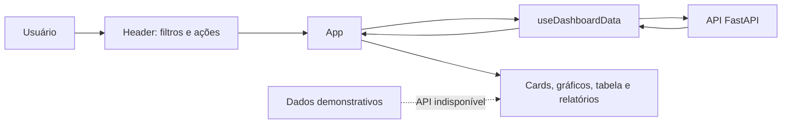

# TimeTrack — Frontend

SPA do TimeTrack para acompanhar a atividade de equipes. Esta é a implementação ativa do produto: usa React, Vite, Tailwind CSS e Recharts. O diretório `legacy/blazor/` é somente uma referência histórica e não participa do build.


## Índice

- [Como executar](#como-executar)
- [Configuração](#configuração)
- [Arquitetura e fluxo](#arquitetura-e-fluxo)
- [Contrato com a API](#contrato-com-a-api)
- [Mapa completo do código](#mapa-completo-do-código)
- [Dados demonstrativos e estados vazios](#dados-demonstrativos-e-estados-vazios)
- [Estilos, acessibilidade e responsividade](#estilos-acessibilidade-e-responsividade)
- [Limitações conhecidas](#limitações-conhecidas)

## Como executar

Pré-requisitos: Node.js 20+ e npm. No PowerShell, use `npm.cmd` para evitar bloqueios de política de execução.

```powershell
cd FrontEnd
npm.cmd install
npm.cmd run dev
```

O Vite inicia normalmente em `http://localhost:5173`. Para validar a versão de produção:

```powershell
npm.cmd run build
npm.cmd run preview
```

| Script | Efeito |
| --- | --- |
| `npm.cmd run dev` | Inicia o servidor de desenvolvimento com recarga automática. |
| `npm.cmd run build` | Gera os arquivos otimizados em `dist/`. |
| `npm.cmd run preview` | Serve localmente o conteúdo gerado em `dist/`. |

## Configuração

| Variável | Padrão | Descrição |
| --- | --- | --- |
| `VITE_API_URL` | `http://localhost:8000` | URL base da API, sem necessidade de barra final. |

Exemplo:

```powershell
$env:VITE_API_URL = "http://servidor-da-api:8000"
npm.cmd run dev
```

A variável é incorporada pelo Vite no início do processo; reinicie o servidor depois de alterá-la.

## Arquitetura e fluxo



`App.jsx` é o orquestrador: mantém a data, o colaborador e a preferência de atualização automática; chama o hook de dados e transforma suas respostas em propriedades para os componentes visuais. Não há biblioteca global de estado: o estado é local e compartilhado por propriedades.

### Atualização dos dados

1. A data inicial é o dia local do navegador, no formato `AAAA-MM-DD`; datas futuras ficam bloqueadas no campo de filtro.
2. `useDashboardData` requisita em paralelo resumo, atividade em tempo real, usuários e sete resumos diários para o gráfico semanal.
3. Uma atualização manual ou o intervalo de 30 segundos aumenta uma chave interna e dispara nova consulta.
4. Ao mudar data ou colaborador, a requisição anterior é cancelada com `AbortController`. Dados de outro filtro não permanecem na tela.
5. Ao atualizar o mesmo filtro, o último resultado continua visível. Caso a consulta falhe, o erro é exibido e o painel usa conteúdo demonstrativo quando não há dados reais.

## Contrato com a API

O cliente está concentrado em `src/services/api.js`; as demais camadas não usam `fetch` diretamente.

| Recurso | Endpoint | Uso no painel |
| --- | --- | --- |
| Resumo diário | `GET /dashboard/summary?date=AAAA-MM-DD[&username=...]` | Métricas, categorias e série semanal. |
| Atividade atual | `GET /activities/realtime` | Pessoas online e tabela da equipe. |
| Usuários | `GET /users/` | Opções do filtro de colaborador. |
| CSV | `GET /dashboard/export/csv?date=...` | Link de download do relatório. |
| PDF | `GET /dashboard/export/pdf?date=...` | Link de download do relatório. |

O resumo diário esperado possui `date`, `users[]`, `users[].total_seconds` e `users[].by_category[]`; cada categoria contém `category`, `color` e `total_seconds`. Um item de atividade em tempo real contém `username`, `hostname`, `process_name`, `window_title`, `category`, `status` e `seconds_since_last_activity`.

A métrica de tempo produtivo é uma regra temporária do frontend: soma todas as categorias, exceto `Social` e `Outros`. A regra oficial deve ser definida pelo produto/API.

## Mapa completo do código

```text
FrontEnd/
├── index.html                 # Documento HTML, fontes externas e ponto #root
├── package.json               # Scripts e dependências do projeto
├── vite.config.js             # Servidor, build, chunks e alias @ → /src
├── tailwind.config.js         # Tema, fontes, cores, animações e dark mode
├── postcss.config.js          # Tailwind e Autoprefixer no processamento CSS
├── src/
│   ├── main.jsx               # Monta <App /> em modo StrictMode
│   ├── App.jsx                # Composição, filtros e métricas do dashboard
│   ├── index.css              # Base global, componentes CSS, impressão e a11y
│   ├── components/            # Componentes de apresentação
│   ├── hooks/useDashboard.js  # Busca do dashboard, tema e seção ativa
│   ├── services/api.js        # Cliente HTTP e URLs de exportação
│   ├── utils/dashboard.js     # Duração, totais e produtividade
│   ├── utils/report.js        # Utilitários CSV locais reutilizáveis
│   └── data/dashboardData.js  # Navegação e dados demonstrativos
├── docs/                      # Guias específicos e capturas de tela
└── legacy/blazor/             # Implementação anterior; fora do build Vite
```

### Componentes

| Arquivo | Responsabilidade | Fonte dos dados |
| --- | --- | --- |
| `Header.jsx` | Filtros de data/usuário, tema, status e atualização manual. | Estado de `App` e lista de usuários. |
| `Sidebar.jsx` | Navegação por âncoras e indicação da seção visível. | `navItems` e `useActiveSection`. |
| `MetricCard.jsx` | Cartão visual de uma métrica. | Propriedades do `App`. |
| `ActivityChart.jsx` | Barras de monitorado versus produtivo nos últimos sete dias. | Resumos semanais ou `week`. |
| `CategoryChart.jsx` | Agrega categorias de todos os usuários e exibe pizza. | Resumo diário ou `categories`. |
| `AppsCard.jsx` | Ranking visual de aplicativos. | Apenas `apps` demonstrativo. |
| `TimelineCard.jsx` | Faixas de atividade durante o expediente. | Apenas `timeline` demonstrativa. |
| `PeopleCard.jsx` | Tabela de atividade mais recente de cada pessoa. | `/activities/realtime` ou `people`. |
| `ReportsAndAgent.jsx` | Links de exportação e chave de atualização automática. | Filtros de `App`. |
| `Card.jsx` | Contêiner visual semântico reutilizável. | `children` e classes opcionais. |
| `SectionHeading.jsx` | Título, descrição e ação opcional de uma seção. | Propriedades do componente pai. |
| `index.js` | Ponto único de exportação dos componentes. | — |

### Hooks, serviços e utilitários

| Arquivo | API pública | Observações |
| --- | --- | --- |
| `hooks/useDashboard.js` | `useDashboardData(date, username, autoRefresh)` | Retorna `data`, estados de carregamento/erro, data da atualização e `refresh`. |
|  | `useTheme()` | Persiste `light`/`dark` em `localStorage` e ajusta `data-theme` no HTML. |
|  | `useActiveSection()` | Usa `IntersectionObserver` nas âncoras declaradas em `navItems`. |
| `services/api.js` | `fetchDashboardData(date, username, signal)` | Busca os recursos necessários em paralelo. |
|  | `getReportUrl(format, date, username)` | Gera URL de exportação preservando filtros. |
| `utils/dashboard.js` | `formatDuration`, `getSummaryTotalSeconds`, `getProductiveSeconds` | Normaliza números inválidos para evitar métricas quebradas. |
| `utils/report.js` | `createDailyReport`, `convertRowsToCsv`, `downloadTextFile`, `formatTime`, `calculatePercentage` | Funções locais de exportação CSV; os botões atuais usam a exportação da API. |
| `data/dashboardData.js` | `week`, `categories`, `apps`, `timeline`, `people`, `navItems` | Conteúdo de demonstração e estrutura de navegação. |

## Dados demonstrativos e estados vazios

O painel continua navegável quando a API não responde: cards e gráficos que têm amostras exibem os dados de `dashboardData.js`. Quando a API responde com sucesso, mas sem registros, os componentes exibem um estado vazio — não dados fictícios. Apps e timeline permanecem demonstrativos porque ainda não existe endpoint que forneça seus dados.

## Estilos, acessibilidade e responsividade

O Tailwind é a fonte principal de estilos. `src/index.css` complementa-o com as classes reutilizáveis `control`, `icon-control`, `primary-button`, `secondary-button`, `pill`, `avatar`, `legend-dot`, `status-dot` e `chart-tooltip`.

- Tema: a raiz recebe `data-theme="dark"`; as variantes `dark:` do Tailwind acompanham esse atributo.
- Layout: a barra lateral só é exibida a partir do breakpoint `lg` (1024 px); grids mudam em `sm`, `lg` e `xl`.
- Acessibilidade: há rótulos ARIA em controles, foco visível, HTML semântico, tabelas com cabeçalho e respeito a `prefers-reduced-motion`.
- Impressão: `index.css` oculta controles e barra lateral, preservando tabela e conteúdo principal.

Detalhes de estilos: [docs/STYLES.md](docs/STYLES.md). Detalhes do contrato e das pendências de integração: [docs/INTEGRACAO-FRONTEND-BACKEND.md](docs/INTEGRACAO-FRONTEND-BACKEND.md).

## Limitações conhecidas

- Não há testes automatizados configurados.
- Ranking de aplicativos e timeline precisam de endpoints próprios.
- O card “Software mais usado” não usa dados reais.
- A regra de produtividade é provisória e pertence ao frontend.
- A área de configurações na barra lateral é apenas informativa.

## Tecnologias

| Tecnologia | Versão | Papel |
| --- | --- | --- |
| React | 18.2.0 | Renderização e estado da interface. |
| Vite | 5.0.8 | Servidor de desenvolvimento e build. |
| Tailwind CSS | 3.4.17 | Estilos e responsividade. |
| Recharts | 2.10.3 | Gráficos de barras e pizza. |
