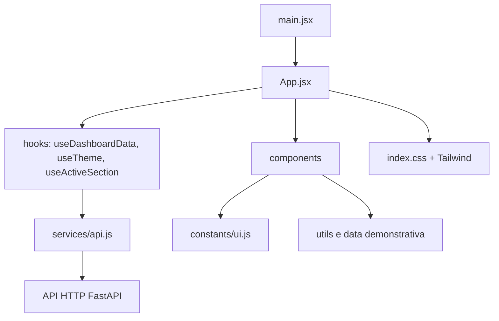

# Arquitetura do frontend

## Camadas



| Camada | Local | Responsabilidade |
| --- | --- | --- |
| Entrada | `src/main.jsx` | Monta `App` no elemento `#root` usando `StrictMode`. |
| Composição | `src/App.jsx` | Mantém filtros/preferências e orquestra a passagem de dados para os componentes. |
| Hooks modulares | `src/hooks/` | Busca de dados (`useDashboardData`), controle de tema (`useTheme`) e rastreamento de scroll (`useActiveSection`). |
| Constantes de UI | `src/constants/ui.js` | Paletas de avatares, status de atividade e rótulos de API compartilhados. |
| HTTP | `src/services/api.js` | Centraliza URL base, `fetch`, resiliência a falhas secundárias e URLs de exportação. |
| Apresentação | `src/components/` | Renderiza seções visuais sem acoplamento direto com a camada de rede. |
| Regras auxiliares | `src/utils/` | Formatação de tempo, totais, produtividade e exportação CSV. |
| Demonstração | `src/data/dashboardData.js` | Dados estáticos para modo offline / demonstração. |

## Estado do dashboard e Hooks

A camada de estado do frontend está modularizada em `src/hooks/`:

- **`useDashboardData(selectedDate, selectedUsername, autoRefresh)`:** Responsável pelo ciclo de vida das requisições, controle de concorrência com `AbortController`, pausas automáticas quando a aba está em segundo plano (Visibility API) e *stale-while-revalidate*.
- **`useTheme()`:** Gerencia tema claro/escuro com persistência em `localStorage` e sincronização do atributo `data-theme` no `<html>`.
- **`useActiveSection()`:** Utiliza `IntersectionObserver` para destacar a seção visível na barra lateral de forma performática.

Consulte [Documentação de Hooks](HOOKS.md) para a especificação detalhada de parâmetros e tipos de retorno.

## Componentes e Contratos

Os componentes visuais estão organizados em `src/components/` e são exportados por `src/components/index.js`. Os dados fluem de cima para baixo como propriedades (*props*).

| Componente | Responsabilidade | Documentação |
| --- | --- | --- |
| `Header` | Filtros de data, seleção de colaborador, status da API e tema. | [Catálogo de Componentes](COMPONENTES.md#header) |
| `Sidebar` | Navegação desktop por âncoras e perfil do usuário. | [Catálogo de Componentes](COMPONENTES.md#sidebar) |
| `MetricCard` | Cartões de indicadores operacionais resumidos. | [Catálogo de Componentes](COMPONENTES.md#metriccard) |
| `ActivityChart` | Gráfico de barras semanais (monitorado vs. produtivo). | [Catálogo de Componentes](COMPONENTES.md#activitychart) |
| `CategoryChart` | Gráfico de rosca com distribuição de categorias. | [Catálogo de Componentes](COMPONENTES.md#categorychart) |
| `PeopleCard` | Tabela em tempo real com atividades da equipe. | [Catálogo de Componentes](COMPONENTES.md#peoplecard) |
| `ReportsAndAgent` | Exportação de relatórios (CSV/PDF) e auto-refresh. | [Catálogo de Componentes](COMPONENTES.md#reportsandagent) |
| `Card`, `SectionHeading` | Blocos visuais reutilizáveis de apresentação. | [Catálogo de Componentes](COMPONENTES.md#componentes-base) |

## Testes Automatizados

O frontend adota **Vitest** e **React Testing Library** com cobertura de componentes, hooks, serviços e utilitários.

```powershell
npm.cmd test
npm.cmd run test:coverage
```

Consulte [Guia de Testes Automatizados](TESTES.md) para diretrizes de escrita e execução.

## Configuração de Build

- `vite.config.js`: porta 5173, alias `@` para `/src`, divisão de bundles (`vendor` para React e `charts` para Recharts) e remoção de `console` em produção.
- `tailwind.config.js`: tema customizado (`ink`, `brand`, `muted`, `line`, `page`), dark mode por `[data-theme="dark"]`.
- `postcss.config.js`: integração do Tailwind e Autoprefixer.

Para validar o build: `npm.cmd run build` a partir de `FrontEnd/`.
