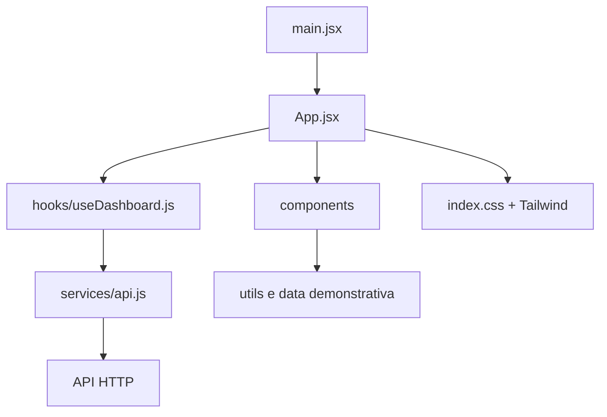

# Arquitetura do frontend

## Camadas

| Camada | Local | Responsabilidade |
| --- | --- | --- |
| Entrada | `src/main.jsx` | Monta `App` no elemento `#root` usando `StrictMode`. |
| Composição | `src/App.jsx` | Mantém filtros/preferências e calcula métricas para os componentes. |
| Estado e efeitos | `src/hooks/useDashboard.js` | Busca dados, agenda atualização, persiste tema e rastreia seção visível. |
| HTTP | `src/services/api.js` | Centraliza URL base, `fetch`, tratamento HTTP e URLs de exportação. |
| Apresentação | `src/components/` | Renderiza as seções e não deve conhecer detalhes de `fetch`. |
| Regras auxiliares | `src/utils/` | Formatação de tempo, totais, produtividade e CSV local. |
| Demonstração | `src/data/dashboardData.js` | Dados estáticos usados quando não há dados reais. |

## Estado do dashboard

`useDashboardData(selectedDate, selectedUsername, autoRefresh)` retorna:

| Campo | Significado |
| --- | --- |
| `data` | Objeto com `summary`, `realtime`, `users` e `weeklySummaries`; é `null` antes de uma resposta válida para o filtro. |
| `loading` | Verdadeiro na primeira consulta de um filtro. |
| `refreshing` | Verdadeiro quando atualiza preservando dados do mesmo filtro. |
| `error` | Último erro não cancelado da consulta. |
| `updatedAt` | Momento local em que a última resposta válida chegou. |
| `refresh()` | Dispara uma nova consulta sem alterar os filtros. |

Cada efeito cria um `AbortController`. A limpeza do efeito cancela a requisição e o temporizador, evitando vazamento e atualização após desmontagem.

## Componentes e contratos

Os componentes são exportados por `src/components/index.js`. Os dados são recebidos como propriedades; a página não usa Context ou store global.

| Componente | Propriedades relevantes |
| --- | --- |
| `Header` | Filtros, tema, status, usuários, atualização e horário. |
| `ActivityChart` | `weeklySummaries`, `useDemoData`. |
| `CategoryChart` | `summaryUsers`, `useDemoData`. |
| `PeopleCard` | `realtimePeople`, `useDemoData`. |
| `ReportsAndAgent` | Data, usuário e controle da atualização automática. |
| `Card`, `MetricCard`, `SectionHeading` | Componentes visuais reutilizáveis. |

## Configuração de build

- `vite.config.js`: porta preferencial 5173, alias `@` para `/src`, divisão de bundles de React e Recharts, source maps desativados e remoção de `console` no build.
- `tailwind.config.js`: classes pesquisadas em `index.html` e `src/`; cores, fontes e animações do projeto; dark mode por `[data-theme="dark"]`.
- `postcss.config.js`: executa Tailwind e Autoprefixer.

Para validar qualquer mudança: `npm.cmd run build` a partir de `FrontEnd/`.
