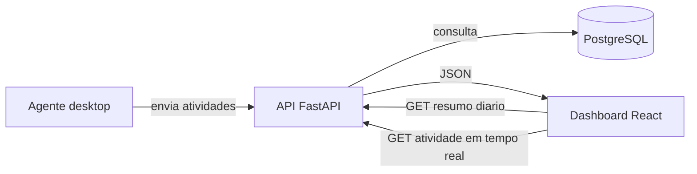

# Integracao entre Frontend e Backend

## Resumo executivo

Foi realizada a primeira integracao do dashboard React com a API FastAPI existente. O frontend deixou de depender exclusivamente dos dados demonstrativos para as informacoes de equipe, atividade em tempo real, categorias e tempo monitorado.

Nenhum arquivo do backend foi alterado. A implementacao usa os endpoints que ja estavam disponiveis e apenas adiciona no frontend a camada de comunicacao, o carregamento dos dados e a adaptacao das respostas para os componentes visuais.

## Objetivo

Permitir que o dashboard consulte informacoes reais armazenadas no banco de dados por meio da API, mantendo a interface utilizavel mesmo quando a API estiver fora do ar.

O fluxo atual e:



## O que foi implementado

### 1. Cliente HTTP no frontend

Foi criado [src/services/api.js](../src/services/api.js).

Responsabilidades:

- definir a URL base da API;
- realizar requisicoes com `fetch`;
- verificar respostas HTTP malsucedidas;
- buscar o resumo diario e a atividade em tempo real;
- montar URLs para exportacoes futuras ou existentes.

A URL padrao e:

```text
http://localhost:8000
```

Ela pode ser substituida pela variavel de ambiente `VITE_API_URL`.

### 2. Carregamento controlado dos dados

Foi criado o hook `useDashboardData` em [src/hooks/useDashboard.js](../src/hooks/useDashboard.js).

Esse hook:

- recebe a data selecionada no dashboard;
- dispara as duas consultas da API em paralelo;
- controla os estados `loading`, `data` e `error`;
- cancela a requisicao anterior quando a data muda ou o componente e desmontado;
- evita atualizar a tela com uma requisicao cancelada.

As consultas sao:

```text
GET /dashboard/summary?date=AAAA-MM-DD
GET /activities/realtime
```

### 3. Integracao no componente principal

Em [src/App.jsx](../src/App.jsx), o dashboard passou a:

- chamar `useDashboardData`;
- enviar a data selecionada para a API;
- somar o tempo total retornado para o indicador de tempo monitorado;
- contar pessoas com status `online`;
- passar o resumo para o grafico de categorias;
- passar a atividade em tempo real para a tabela da equipe;
- mostrar estados de carregamento e indisponibilidade;
- informar no cabecalho se a API esta conectando, online ou offline.

### 4. Adaptacao dos componentes

O componente [src/components/CategoryChart.jsx](../src/components/CategoryChart.jsx) agora transforma `users[].by_category` da API em uma lista agregada por categoria. Assim, categorias repetidas entre colaboradores sao somadas antes de serem exibidas no grafico.

O componente [src/components/PeopleCard.jsx](../src/components/PeopleCard.jsx) transforma cada registro de `/activities/realtime` no formato visual esperado pela tabela:

| Resposta da API | Exibicao no frontend |
|---|---|
| `username` | Colaborador |
| `hostname` | Maquina |
| `process_name` | Aplicativo |
| `window_title` | Janela |
| `category` | Categoria |
| `status` | Status |
| `seconds_since_last_activity` | Ultima atividade |

## Endpoints utilizados

### Resumo diario

```http
GET /dashboard/summary?date=2026-09-06
```

Usado para obter:

- total de segundos por colaborador;
- distribuicao do tempo por categoria;
- cor configurada para cada categoria.

### Atividade em tempo real

```http
GET /activities/realtime
```

Usado para obter:

- colaborador;
- maquina;
- processo ativo;
- titulo da janela;
- categoria classificada;
- status online ou ausente;
- tempo desde a ultima atividade.

## Exemplo de resposta esperada

Resumo diario:

```json
{
  "date": "2026-09-06",
  "users": [
    {
      "username": "ana",
      "total_seconds": 24120,
      "by_category": [
        {
          "category": "Desenvolvimento",
          "color": "#6551e1",
          "total_seconds": 18000
        }
      ]
    }
  ]
}
```

Atividade em tempo real:

```json
[
  {
    "username": "ana",
    "hostname": "DESK-AC-01",
    "process_name": "Code.exe",
    "window_title": "feature/dashboard.jsx",
    "category": "Desenvolvimento",
    "is_idle": false,
    "seconds_since_last_activity": 12,
    "status": "online"
  }
]
```

## Tratamento de indisponibilidade

Quando a API nao responde ou retorna erro HTTP:

- o erro e armazenado pelo hook;
- o cabecalho mostra `API offline`;
- o dashboard mostra uma mensagem de indisponibilidade;
- os componentes usam os dados demonstrativos existentes como fallback.

Esse comportamento permite apresentar e navegar pelo prototipo sem banco ou backend ativos, mas deixa visivel que os dados nao sao reais naquele momento.

## O que ainda permanece demonstrativo

A API atual nao possui endpoints suficientes para alimentar todos os blocos do dashboard. Por isso, continuam usando dados locais:

- grafico semanal de atividade;
- timeline do expediente;
- ranking de aplicativos mais usados;
- tempo produtivo;
- software mais usado;
- informacoes fixas do agente na secao de status.

Esses blocos somente devem ser considerados totalmente integrados quando houver dados ou endpoints correspondentes no contrato da API.

## Como executar

Com a API disponivel em `http://localhost:8000`:

```powershell
cd FrontEnd
npm.cmd install
npm.cmd run dev
```

Para usar outra URL:

```powershell
$env:VITE_API_URL="http://servidor-da-api:8000"
npm.cmd run dev
```

A aplicacao pode ser acessada normalmente em `http://localhost:5173`.

## Validacao realizada

O build de producao foi executado com sucesso:

```text
npm.cmd run build
vite build
built successfully
```

Tambem foi feita verificacao de erros nos arquivos alterados do frontend, sem erros encontrados.

## Mensagem para apresentacao a lideranca

> O frontend foi conectado aos endpoints existentes do backend sem alterar a API. O dashboard agora consulta o resumo diario e a atividade em tempo real, transforma as respostas do banco para o formato dos componentes React e apresenta dados de equipe, categorias, tempo monitorado e pessoas online. Tambem foram incluidos estados de carregamento, erro e fallback para preservar a navegacao quando a API estiver indisponivel. As areas que dependem de dados ainda nao expostos pelo backend permanecem demonstrativas e foram identificadas para uma proxima etapa.
